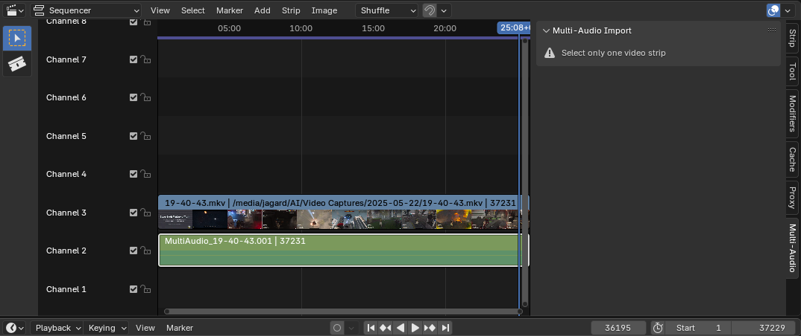
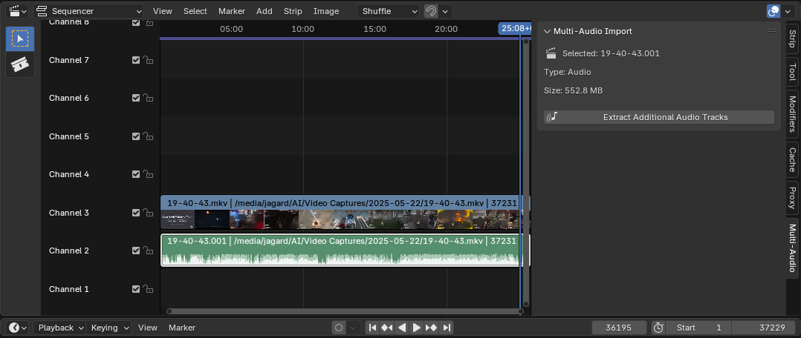
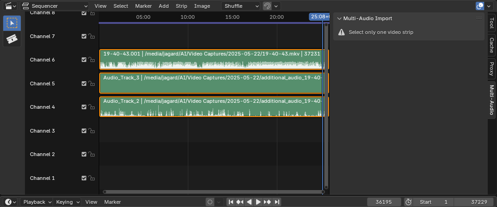

# 🎧 Multi-Audio Importer — Blender Add-on

**Easily import all audio tracks from multi-track video files into Blender's Video Sequence Editor (VSE).**

Multi-Audio Importer is a powerful Blender addon that automatically detects, extracts, and imports all audio tracks from video files (such as multi-language movies, commentaries, or recordings with multiple microphones) directly into Blender's Video Sequence Editor as organized metastrips.

---

## ✨ Features

- **🔍 Smart Detection**: Automatically scans video files for all embedded audio tracks using FFprobe
- **🎯 Selective Import**: Choose which additional audio tracks to extract and import
- **📦 Metastrip Organization**: Groups original video with all audio tracks in a clean metastrip
- **⚡ Auto-Download**: Automatically downloads and installs static FFmpeg binaries (no manual installation required)
- **🛡️ Timeline Safety**: Preserves existing timeline content and original strip properties
- **📊 Progress Tracking**: Real-time progress updates with detailed logging
- **🎬 Format Support**: Works with `.mkv`, `.mp4`, `.mov`, `.avi`, and other container formats
- **🔧 Cross-Platform**: Supports Windows, macOS, and Linux

---

## 🛠 Requirements

- **Blender** 3.0+ (tested up to 4.x)
- **Internet connection** (for automatic FFmpeg download on first use)

> **Note**: The addon automatically downloads static FFmpeg binaries on first use, so manual FFmpeg installation is optional but can be done for better performance.

---

## 📥 Installation

### Method 1: Direct Installation (Recommended)

1. **Download** the addon file: [`multi_audio_importer.py`](multi_audio_importer.py)

2. **Open Blender** → Go to **Edit > Preferences > Add-ons**

3. **Click "Install..."** and select the downloaded `.py` file

4. **Enable** the addon by checking the box next to **"Multi-Audio Track Video Importer"**

5. **First Run Setup**: The addon will automatically offer to download FFmpeg binaries when first used

### Method 2: Manual FFmpeg Installation (Optional)

If you prefer to use your own FFmpeg installation or the auto-download fails:

1. Download FFmpeg from [https://ffmpeg.org/download.html](https://ffmpeg.org/download.html)
2. Add the FFmpeg `bin` folder to your system PATH
3. Restart Blender

---

## 🎬 How to Use

### Step 1: Prepare Your Video
1. Open the **Video Editing** workspace in Blender
2. Import your multi-track video file into the VSE timeline
3. **Disconnect the audio track from the video track** (Right-click the video strip → "Separate Images and Sound" or press `Y`)
4. **Select only the video strip** you want to process

> **⚠️ Important Notes:**
> - The addon **requires the audio to be disconnected from the video track** before processing
> - The addon **will not work when multiple strips are selected** - select only one video strip at a time
> - Use "Separate Images and Sound" (Y hotkey) to disconnect audio from video before processing

### Step 2: Access the Multi-Audio Panel
1. In the **Side Panel** (press `N` if hidden), locate the **"Multi-Audio"** tab
2. The panel will show information about your selected video strip
3. Click **"Extract Additional Audio Tracks"**

### Step 3: Automatic Processing
The addon will automatically:
- Scan the video file for all audio tracks
- Extract additional audio tracks (beyond the first one)
- Create individual audio strips for each track
- Group everything into a clean metastrip
- Restore the original position and properties

### Step 4: Working with Results
- The resulting metastrip contains your original video plus all audio tracks
- Enter the metastrip (Tab) to access individual audio tracks
- Each track is labeled with its language or track number
- All original timing, trimming, and effects are preserved

---

## 🧩 Technical Details

### How It Works
1. **Detection**: Uses FFprobe to analyze video files and identify all embedded audio streams
2. **Extraction**: Safely extracts additional audio tracks using FFmpeg with precise timing
3. **Import**: Creates Blender sound strips for each extracted track
4. **Organization**: Groups all content into a metastrip while preserving original properties
5. **Cleanup**: Automatically removes temporary files

### Supported Audio Formats
- **Input**: Any format supported by FFmpeg (AAC, MP3, AC3, DTS, PCM, etc.)
- **Output**: Efficiently compressed audio (AAC/PCM) optimized for Blender

### Performance Features
- **Smart Timeout**: Dynamically adjusts processing time based on file size
- **Progress Tracking**: Real-time progress updates with ETA
- **Memory Efficient**: Processes tracks sequentially to minimize RAM usage
- **Error Handling**: Robust error recovery with detailed logging

---

## ❓ Troubleshooting

### Common Issues

**"FFmpeg binaries not found"**
- The addon will offer to auto-download FFmpeg on first use
- Go to **Edit > Preferences > Add-ons > Multi-Audio Track Video Importer** and click "Download FFmpeg Binaries"
- Or manually install FFmpeg and add it to your system PATH

**"No additional tracks found"**
- The video file may only contain one audio track
- Ensure you're using a video with multiple audio streams (common in MKV files)
- Try with a different video file to test functionality

**"Source file not found"**
- The video file path may be broken due to moving files
- Use Blender's "Make Paths Relative" feature
- Verify the source video file still exists at the expected location

**Steam Version of Blender**
- Steam installations may have path restrictions
- Consider using the standalone Blender version for better compatibility
- Manual FFmpeg installation may be required

### Debug Information
The addon provides detailed logging in Blender's Info panel and console:
- Audio track analysis results
- Extraction progress and timing
- File size and duration information
- Error details for troubleshooting

---

## 🔧 Advanced Usage

### Working with Different File Types
- **MKV**: Often contains multiple language tracks (best compatibility)
- **MP4**: May have commentary or multiple audio sources
- **MOV**: Professional video formats with separate audio channels
- **AVI**: Older format but still supported

### Metastrip Benefits
- **Organization**: All related tracks grouped together
- **Preservation**: Original properties and timing maintained
- **Flexibility**: Can still access individual tracks when needed
- **Timeline Safety**: No interference with existing content

### Performance Tips
- Larger files take longer to process but show progress
- Multiple audio tracks increase processing time proportionally
- SSDs significantly improve extraction speed
- Close unnecessary applications during processing of large files

---

## 🤝 Contributing

This addon is open source and welcomes contributions:
- **Bug Reports**: Use the issue tracker for problems
- **Feature Requests**: Suggest improvements or new functionality
- **Code Contributions**: Submit pull requests for fixes or enhancements
- **Documentation**: Help improve setup guides and troubleshooting

---

## 📄 License

This project is licensed under the GNU General Public License v3.0 - see the LICENSE file for details.

---

## 👏 Credits

- **Author**: Jagard11 & Claude AI
- **FFmpeg**: Uses the excellent FFmpeg project for audio processing
- **Community**: Thanks to the Blender community for feedback and testing

---

## 📬 Support

If you encounter issues or need help:
1. Check the troubleshooting section above
2. Review Blender's console for error messages
3. Ensure your video file has multiple audio tracks
4. Try the addon with a known multi-track file (like an MKV with multiple languages)

**Enjoy seamless multi-track audio editing in Blender! 🎬🎵** 