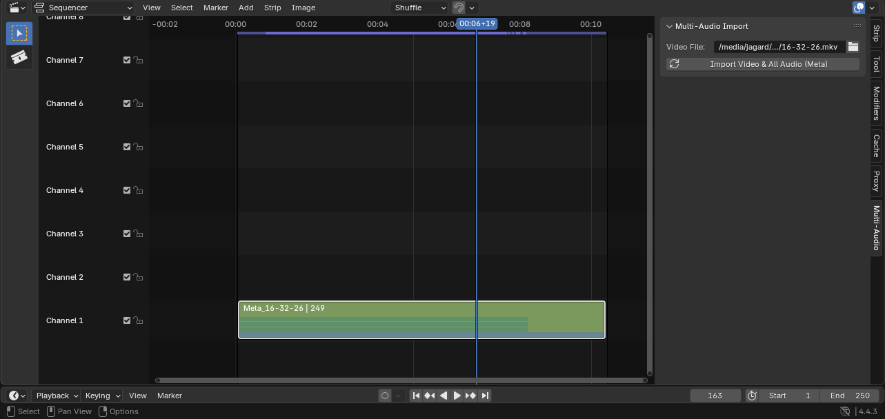
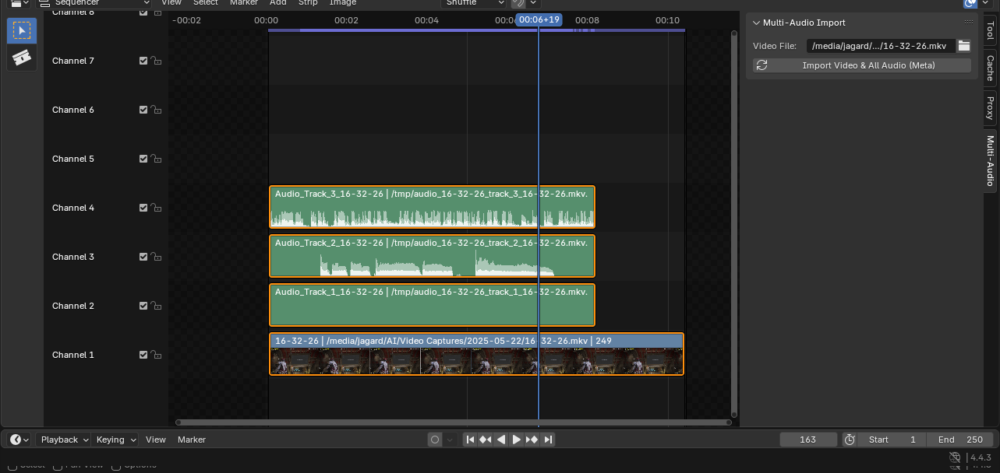

# Multi-Audio Track Video Importer for Blender


A powerful Blender addon that automatically imports video files with **all their audio tracks** into organized metastrips in the Video Sequence Editor (VSE). Perfect for working with multi-language videos, multiple audio commentary tracks, or any video with multiple audio streams.

## 🎯 Recent Major Update (v2.0)

**✅ Fixed Audio Track Truncation**: The addon now correctly extracts the full natural length of all audio tracks, eliminating the "abrupt ending" issue that occurred with simultaneously recorded tracks. All audio tracks are now imported with their complete duration, preserving perfect sync with video content.

## 📸 See It In Action


*The addon in action: Video and audio tracks organized in a clean metastrip with the simple import interface*


*Inside the metastrip: Each audio track is perfectly organized on its own channel for easy editing and mixing*

## ⚠️ Platform Compatibility Warning

**This addon has currently only been tested on Linux systems.** While it may work on Windows and macOS, we cannot guarantee compatibility or provide support for these platforms at this time. Use on non-Linux systems at your own risk.

## ✨ Features

- **🎬 Complete Video Import**: Imports the video file along with ALL audio tracks
- **📦 Clean Organization**: All tracks are packaged into a single metastrip to keep your timeline clean  
- **🔄 Auto-Setup**: Automatically downloads required FFmpeg static binaries (no system dependencies!)
- **🌍 Multi-Language Support**: Properly handles language tags and track identification
- **⚡ One-Click Import**: Simple workflow - select video, click import, done!
- **🛡️ Steam Runtime Compatible**: Works even when Blender is launched through Steam

## 🚀 Installation

### Method 1: Direct Download
1. Download the `multi_audio_importer.py` file from this repository
2. Open Blender and go to `Edit > Preferences > Add-ons`
3. Click `Install...` and select the downloaded `.py` file
4. Enable the addon by checking the box next to "Multi-Audio Track Video Importer"

### Method 2: Git Clone
```bash
git clone https://github.com/yourusername/multi_audio_importer.git
cd multi_audio_importer
# Then install multi_audio_importer.py through Blender as above
```

## 📋 Requirements

- **Blender 3.0 or higher**
- **Internet connection** (for initial FFmpeg binary download)
- **Linux operating system** (other platforms untested)
- **~80MB free disk space** (for FFmpeg static binaries)

## 🎯 Usage

### First Time Setup
1. After installing the addon, open the **Video Sequence Editor** workspace in Blender
2. In the sidebar (press `N` if not visible), look for the **"Multi-Audio"** tab
3. The addon will automatically download FFmpeg binaries on first use (~40MB download)

### Importing Videos
1. **Open Video Sequence Editor**: Switch to the Video Editing workspace
2. **Locate the Addon Panel**: Find "Multi-Audio Import" in the sidebar (N-panel)
3. **Select Video File**: Click the folder icon next to "Video File" and choose your video
4. **Import**: Click "Import Video & All Audio (Meta)" 
5. **Done!** Your video and all audio tracks are now in a metastrip on your timeline

### Working with Metastrips
- **Enter Metastrip**: Double-click the metastrip to edit individual tracks
- **Exit Metastrip**: Press `Tab` or click the back arrow
- **Organize Tracks**: Inside the metastrip, each audio track is on its own channel
- **Track Names**: Audio tracks are labeled with language/track information when available

### Audio Synchronization
- **Perfect Sync**: All audio tracks maintain exact synchronization with video
- **Simultaneous Recording Support**: Correctly handles tracks recorded at the same time
- **No Duration Loss**: Preserves complete audio content without truncation
- **Native Format Preservation**: Uses audio copy mode to avoid timing corruption

## 🎨 Example Workflow

```
1. Video file: "movie.mkv" (contains video + English + Spanish + Commentary audio)
   ↓
2. Import with addon
   ↓  
3. Result: Single metastrip "Meta_movie" containing:
   - Channel 1: Video track
   - Channel 2: Audio_eng_movie  
   - Channel 3: Audio_spa_movie
   - Channel 4: Audio_Track_3_movie (commentary)
```

## ⚙️ Addon Preferences

Access via `Edit > Preferences > Add-ons > Multi-Audio Track Video Importer`:

- **✅ Binary Status**: Shows if FFmpeg binaries are installed
- **🔄 Re-download**: Manually re-download FFmpeg binaries if needed
- **📍 Location**: Shows where binaries are stored

## 🛠️ Troubleshooting

### "FFmpeg binaries not found"
- **Solution**: Go to addon preferences and click "Download FFmpeg Static Binaries"
- **Cause**: Usually happens if initial auto-download failed

### "Failed to scan audio tracks"
- **Check**: Ensure your video file actually contains audio tracks
- **Try**: Re-download FFmpeg binaries in addon preferences
- **Verify**: File path is correct and file isn't corrupted

### Audio tracks cut off/truncated (FIXED in v2.0)
- **Previous Issue**: Audio tracks would end abruptly around 16-17 minutes
- **Resolution**: Now extracts full natural track duration without forced time limits
- **Result**: Perfect sync for simultaneously recorded tracks

### Import button disabled/greyed out
- **Solution**: This issue has been resolved in v2.0 - the button should always be enabled
- **If persists**: Restart Blender and re-enable the addon

### Video imports but no audio
- **Check**: Your video file may not have multiple audio tracks
- **Verify**: Try the file in a media player that shows track information (like VLC)

## 🔧 Technical Details

### How It Works
1. Uses `ffprobe` to scan video files for audio track information
2. Extracts each audio track in its native format using `ffmpeg` with `-acodec copy` (no re-encoding)
3. Preserves the full natural duration of each track without forced truncation
4. Imports video and audio files as separate strips in Blender's VSE
5. Groups all strips into a single metastrip for organization
6. Names tracks based on language tags or track indices

### FFmpeg Integration
- Downloads static FFmpeg binaries automatically (no system installation required)
- Binaries are stored in the addon directory
- Uses industry-standard FFmpeg for maximum compatibility
- **Smart Extraction**: Copies audio streams without re-encoding to preserve timing accuracy
- **Full Duration Preservation**: Extracts complete track lengths for perfect video sync
- Supports virtually all video formats that contain multiple audio tracks

## 🤝 Contributing

Contributions are welcome! Please feel free to:
- Report bugs via GitHub issues
- Submit feature requests  
- Test on different platforms (especially Windows/macOS)
- Improve documentation
- Submit pull requests

## 📝 License

This project is licensed under the GPL-3.0 License - see the LICENSE file for details.

## 🙏 Credits

- **Original Concept**: Parham Ettehadieh
- **Development**: Jagard11 & Claude AI  
- **FFmpeg**: The FFmpeg team for their incredible multimedia framework
- **Static Builds**: John Van Sickle for providing reliable FFmpeg static builds

## 📚 Additional Resources

- [Blender VSE Documentation](https://docs.blender.org/manual/en/latest/video_editing/index.html)
- [FFmpeg Documentation](https://ffmpeg.org/documentation.html)
- [Video Tutorial](https://youtu.be/ZeXZrap67jk) (Original addon demonstration)

---

**⭐ If this addon helps your workflow, please consider giving it a star on GitHub!**
